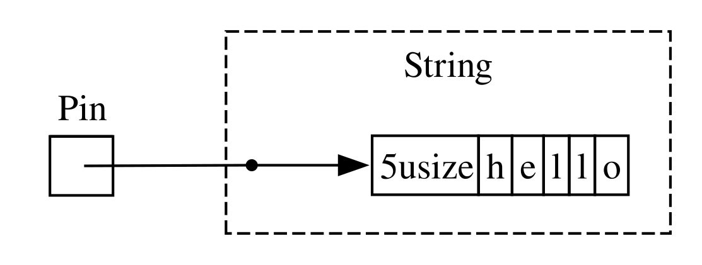

<!-- Old headings. Do not remove or links may break. -->

<a id="digging-into-the-traits-for-async"></a>

## เจาะลึก Trait สำหรับ Async

ตลอดทั้งบทนี้ เราได้ใช้ trait `Future`, `Stream`, และ `StreamExt` ในหลากหลายรูปแบบ อย่างไรก็ตาม จนถึงตอนนี้เรายังคงเลี่ยงที่จะลงลึกในรายละเอียดว่าพวกมันทำงานอย่างไรหรือเกี่ยวข้องกันอย่างไร ซึ่งก็เพียงพอสำหรับการทำงานในชีวิตประจำวันด้วย Rust โดยทั่วไป แต่ในบางครั้ง คุณอาจต้องเผชิญกับสถานการณ์ที่จำเป็นต้องเข้าใจรายละเอียดของ trait เหล่านี้มากขึ้น รวมถึงชนิดข้อมูล `Pin` และ trait `Unpin` ด้วย ในหัวข้อนี้ เราจะเจาะลึกเพียงพอที่จะช่วยในสถานการณ์เหล่านั้น โดยปล่อยให้การลงลึก _จริงๆ_ เป็นหน้าที่ของเอกสารประกอบอื่นๆ

<!-- Old headings. Do not remove or links may break. -->

<a id="future"></a>

### Trait `Future`

ลองเริ่มต้นด้วยการดูการทำงานของ trait `Future` อย่างใกล้ชิด นี่คือวิธีที่ Rust นิยามมันไว้:

```rust
use std::pin::Pin;
use std::task::{Context, Poll};

pub trait Future {
    type Output;

    fn poll(self: Pin<&mut Self>, cx: &mut Context<'_>) -> Poll<Self::Output>;
}
```

คำนิยามของ trait นี้ประกอบด้วยชนิดข้อมูลใหม่จำนวนหนึ่งและไวยากรณ์ที่เรายังไม่เคยเห็นมาก่อน ดังนั้นเรามาไล่ดูนิยามนี้ไปทีละส่วนกัน

ประการแรก associated type ที่ชื่อ `Output` ของ `Future` จะบอกว่า future นั้นจะคืนค่าผลลัพธ์เป็นอะไร ซึ่งคล้ายคลึงกับ associated type `Item` สำหรับ trait `Iterator`
ประการที่สอง `Future` มีเมธอด `poll` ซึ่งรับพารามิเตอร์ `self` เป็นพารามิเตอร์อ้างอิงแบบพิเศษ `Pin` และรับการอ้างอิงแบบเปลี่ยนค่าได้ (mutable reference) ไปยังชนิดข้อมูล `Context` และคืนค่าเป็น `Poll<Self::Output>` เราจะพูดถึง `Pin` และ `Context` เพิ่มเติมในอีกสักครู่ สำหรับตอนนี้ ให้เรามุ่งเน้นไปที่สิ่งที่เมธอดนี้คืนค่าออกมา นั่นคือชนิดข้อมูล `Poll`:

```rust
pub enum Poll<T> {
    Ready(T),
    Pending,
}
```

ชนิดข้อมูล `Poll` นี้คล้ายกับ `Option` โดยมีแวเรียนต์หนึ่งที่มีค่าคือ `Ready(T)` และแวเรียนต์หนึ่งที่ไม่มีค่าคือ `Pending` อย่างไรก็ตาม `Poll` มีความหมายที่แตกต่างจาก `Option` อยู่พอสมควร! แวเรียนต์ `Pending` บ่งบอกว่า future ยังมีงานที่ต้องทำอยู่ ดังนั้นผู้เรียกจะต้องกลับมาตรวจสอบใหม่อีกครั้งในภายหลัง ส่วนแวเรียนต์ `Ready` บ่งบอกว่า `Future` ทำงานเสร็จเรียบร้อยแล้วและมีค่า `T` พร้อมใช้งาน

> หมายเหตุ: เป็นเรื่องยากที่เราจะต้องเรียกใช้ `poll` โดยตรง แต่หากคุณจำเป็นต้องเรียกใช้ โปรดจำไว้ว่าสำหรับ future ส่วนใหญ่ ผู้เรียกไม่ควรเรียก `poll` ซ้ำอีกหลังจากที่ future คืนค่า `Ready` แล้ว future จำนวนมากจะเกิด panic หากถูก poll อีกครั้งหลังจากพร้อมใช้งานแล้ว ส่วน future ที่ปลอดภัยในการ poll ซ้ำจะระบุไว้โดยชัดแจ้งในเอกสารประกอบ ซึ่งคล้ายกับพฤติกรรมของ `Iterator::next`

เมื่อคุณเห็นโค้ดที่ใช้ `await` Rust จะคอมไพล์โค้ดนั้นเบื้องหลังให้เป็นโค้ดที่เรียกใช้ `poll` หากคุณย้อนกลับไปดูในโค้ดตัวอย่างที่ 17-4 ที่เราพิมพ์ชื่อหน้าเว็บสำหรับ URL เดี่ยวเมื่อประมวลผลเสร็จ Rust จะคอมไพล์โค้ดนั้นให้ออกมาในลักษณะประมาณนี้ (แม้ว่าจะไม่ได้เหมือนเป๊ะก็ตาม):

```rust,ignore
match page_title(url).poll() {
    Ready(page_title) => match page_title {
        Some(title) => println!("The title for {url} was {title}"),
        None => println!("{url} had no title"),
    }
    Pending => {
        // But what goes here?
    }
}
```

เราควรทำอย่างไรเมื่อ future ยังคงเป็น `Pending`? เราต้องการวิธีบางอย่างในการพยายามใหม่ซ้ำแล้วซ้ำเล่าจนกว่า future จะพร้อมใช้งานในที่สุด กล่าวอีกนัยหนึ่งคือเราต้องการลูป:

```rust,ignore
let mut page_title_fut = page_title(url);
loop {
    match page_title_fut.poll() {
        Ready(value) => match page_title {
            Some(title) => println!("The title for {url} was {title}"),
            None => println!("{url} had no title"),
        }
        Pending => {
            // continue
        }
    }
}
```

ทว่าหาก Rust คอมไพล์เป็นโค้ดแบบนั้นทุกประการ ทุกๆ `await` ก็จะกลายเป็นการบล็อก (blocking) ซึ่งตรงกันข้ามกับสิ่งที่เราต้องการอย่างสิ้นเชิง! แทนที่จะทำเช่นนั้น Rust จะทำให้มั่นใจว่าลูปสามารถส่งต่อการควบคุมไปยังสิ่งที่สามารถหยุดการทำงานของ future นี้ชั่วคราว เพื่อไปทำงานกับ future อื่นๆ แล้วค่อยกลับมาตรวจสอบ future นี้อีกครั้งในภายหลัง ดังที่เราได้เห็นแล้ว สิ่งนั้นก็คือ async runtime และงานจัดคิวและประสานงานนี้ก็เป็นหนึ่งในหน้าที่หลักของมัน

ในส่วน [“Sending Data Between Two Tasks Using Message Passing”][message-passing]<!-- ignore --> เราได้อธิบายการรอคอย `rx.recv` การเรียก `recv` จะคืนค่าเป็น future และการใช้ `await` กับ future นั้นจะเป็นการ poll มัน เราได้ระบุว่า runtime จะหยุดพัก future ไว้ชั่วคราว จนกว่ามันจะพร้อมด้วยค่า `Some(message)` หรือ `None` เมื่อ channel ปิดตัวลง ด้วยความเข้าใจที่ลึกซึ้งยิ่งขึ้นเกี่ยวกับ trait `Future` และโดยเฉพาะอย่างยิ่ง `Future::poll` เราจะเห็นได้ว่ากระบวนการนั้นทำงานอย่างไร runtime รู้ว่า future ยังไม่พร้อมเมื่อมันคืนค่า `Poll::Pending` ในทางกลับกัน runtime รู้ว่า future _พร้อมแล้ว_ และดำเนินการต่อเมื่อ `poll` คืนค่าเป็น `Poll::Ready(Some(message))` หรือ `Poll::Ready(None)`

รายละเอียดที่แม่นยำว่า runtime ทำสิ่งนั้นอย่างไรนั้นเกินขอบเขตของหนังสือเล่มนี้ แต่หัวใจสำคัญคือการมองเห็นกลไกพื้นฐานของ future: runtime จะ _poll_ แต่ละ future ที่มันรับผิดชอบ และพา future นั้นกลับไปหลับพักผ่อนเมื่อมันยังไม่พร้อม

<!-- Old headings. Do not remove or links may break. -->

<a id="pinning-and-the-pin-and-unpin-traits"></a>
<a id="the-pin-and-unpin-traits"></a>

### ชนิดข้อมูล `Pin` และ Trait `Unpin`

ย้อนกลับไปในโค้ดตัวอย่างที่ 17-13 เราใช้แมโคร `trpl::join!` เพื่อรอคอย future สามตัว อย่างไรก็ตาม เป็นเรื่องปกติที่เราจะมีคอลเลกชัน เช่น vector ที่บรรจุ future จำนวนหนึ่งซึ่งจะไม่ทราบจำนวนจนกว่าจะถึงเวลาทำงาน (runtime) เรามาเปลี่ยนโค้ดตัวอย่างที่ 17-13 ให้เป็นโค้ดในตัวอย่างที่ 17-23 ที่นำ future ทั้งสามตัวใส่ลงใน vector แล้วเรียกใช้ฟังก์ชัน `trpl::join_all` แทน ซึ่งโค้ดนี้จะยังไม่สามารถคอมไพล์ได้ในตอนนี้

<Listing number="17-23" caption="การรอคอย future ในคอลเลกชัน" file-name="src/main.rs">

```rust,ignore,does_not_compile
{{#rustdoc_include ../listings/ch17-async-await/listing-17-23/src/main.rs:here}}
```

</Listing>

เราใส่แต่ละ future ไว้ภายใน `Box` เพื่อแปลงให้เป็น _trait object_ เหมือนที่เราเคยทำในส่วน “การคืนค่าข้อผิดพลาดจาก `run`” ในบทที่ 12 (เราจะครอบคลุมเรื่อง trait object โดยละเอียดในบทที่ 18) การใช้ trait object ทำให้เราสามารถปฏิบัติต่อ future นิรนาม (anonymous future) แต่ละตัวที่สร้างขึ้นจากประเภทเหล่านี้เสร็จเป็นประเภทเดียวกันได้ เพราะทุกตัวต่างก็นำ trait `Future` ไปใช้งาน (implement)

สิ่งนี้อาจสร้างความประหลาดใจ เพราะท้ายที่สุดแล้ว ไม่มีบล็อก async ไหนคืนค่าอะไรเลย ดังนั้นแต่ละบล็อกจึงสร้าง `Future<Output = ()>` ออกมา แต่โปรดจำไว้ว่า `Future` เป็น trait และคอมไพเลอร์จะสร้าง enum ที่มีเอกลักษณ์เฉพาะสำหรับแต่ละบล็อก async แม้ว่าจะให้ประเภทของผลลัพธ์ที่เหมือนกันก็ตาม เช่นเดียวกับที่คุณไม่สามารถใส่ struct สองตัวที่เขียนขึ้นต่างกันลงใน `Vec` เดียวกันได้ คุณก็ไม่สามารถผสม enum ที่คอมไพเลอร์สร้างขึ้นต่างกันได้เช่นกัน

จากนั้นเราผ่านคอลเลกชันของ future ไปยังฟังก์ชัน `trpl::join_all` แล้วรอคอยผลลัพธ์ อย่างไรก็ตาม โค้ดนี้คอมไพล์ไม่ผ่าน นี่คือส่วนที่เกี่ยวข้องของข้อความผิดพลาด:

<!-- manual-regeneration
cd listings/ch17-async-await/listing-17-23
cargo build
copy *only* the final `error` block from the errors
-->

```text
error[E0277]: `dyn Future<Output = ()>` cannot be unpinned
  --> src/main.rs:48:33
   |
48 |         trpl::join_all(futures).await;
   |                                 ^^^^^ the trait `Unpin` is not implemented for `dyn Future<Output = ()>`
   |
   = note: consider using the `pin!` macro
           consider using `Box::pin` if you need to access the pinned value outside of the current scope
   = note: required for `Box<dyn Future<Output = ()>>` to implement `Future`
note: required by a bound in `futures_util::future::join_all::JoinAll`
  --> file:///home/.cargo/registry/src/index.crates.io-1949cf8c6b5b557f/futures-util-0.3.30/src/future/join_all.rs:29:8
   |
27 | pub struct JoinAll<F>
   |            ------- required by a bound in this struct
28 | where
29 |     F: Future,
   |        ^^^^^^ required by this bound in `JoinAll`
```

หมายเหตุในข้อความผิดพลาดนี้บอกเราว่า เราควรใช้แมโคร `pin!` เพื่อ _pin_ (ตรึง) ค่าเหล่านั้น ซึ่งหมายถึงการนำค่าเหล่านั้นไปไว้ภายในชนิดข้อมูล `Pin` ที่รับประกันว่าค่าจะไม่ถูกย้ายตำแหน่งในหน่วยความจำ ข้อความผิดพลาดระบุว่าจำเป็นต้องมีการตรึง (pinning) เนื่องจาก `dyn Future<Output = ()>` จำเป็นต้องนำ trait `Unpin` ไปใช้งาน แต่ในปัจจุบันยังไม่ได้ทำ

ฟังก์ชัน `trpl::join_all` คืนค่า struct ที่เรียกว่า `JoinAll` ซึ่ง struct นั้นเป็นเจเนอริกกับชนิดข้อมูล `F` ที่ถูกจำกัดไว้ว่าต้องนำ trait `Future` ไปใช้งาน การรอคอย future โดยตรงด้วย `await` จะทำการ pin future โดยนัย (implicitly) นั่นคือเหตุผลที่เราไม่จำเป็นต้องใช้ `pin!` ในทุกๆ ที่ที่เราต้องการ await future

อย่างไรก็ตาม ในที่นี้เราไม่ได้รอคอย future โดยตรง แต่เรากำลังสร้าง future ตัวใหม่ขึ้นมาคือ JoinAll โดยการผ่านคอลเลกชันของ future ไปยังฟังก์ชัน `join_all` รายละเอียดของฟังก์ชัน `join_all` กำหนดให้ประเภทของรายการในคอลเลกชันทั้งหมดต้องนำ trait `Future` ไปใช้งาน และ `Box<T>` จะนำ `Future` ไปใช้งานก็ต่อเมื่อ `T` ที่มันห่อหุ้มอยู่นั้นเป็น future ที่นำ trait `Unpin` ไปใช้งานด้วย

มีเรื่องให้ทำความเข้าใจเยอะมาก! เพื่อให้เข้าใจอย่างแท้จริง เรามาเจาะลึกลงไปอีกเล็กน้อยว่า trait `Future` ทำงานอย่างไร โดยเฉพาะอย่างยิ่งในเรื่องเกี่ยวกับการ pin ให้ลองดูนิยามของ trait `Future` อีกครั้ง:

```rust
use std::pin::Pin;
use std::task::{Context, Poll};

pub trait Future {
    type Output;

    // Required method
    fn poll(self: Pin<&mut Self>, cx: &mut Context<'_>) -> Poll<Self::Output>;
}
```

พารามิเตอร์ `cx` และชนิดข้อมูล `Context` ของมันเป็นกุญแจสำคัญว่า runtime รู้ได้อย่างไรว่าเมื่อใดควรตรวจสอบ future ใดๆ โดยที่ยังคงทำงานแบบประหยัดพลังงาน (lazy) อีกครั้ง รายละเอียดการทำงานของสิ่งนี้เกินขอบเขตของบทนี้ และโดยทั่วไปคุณต้องคิดถึงเรื่องนี้เมื่อเขียนการนำ `Future` ไปใช้งานเองเท่านั้น เราจะเน้นไปที่ชนิดข้อมูลของ `self` แทน เนื่องจากนี่เป็นครั้งแรกที่เราได้เห็นเมธอดที่ `self` มีการระบุชนิดข้อมูล (type annotation) การระบุชนิดข้อมูลสำหรับ `self` ทำงานเหมือนกับการระบุชนิดข้อมูลสำหรับพารามิเตอร์ของฟังก์ชันอื่นๆ แต่มีข้อแตกต่างหลักสองประการ:

- มันบอก Rust ว่า `self` ต้องเป็นชนิดข้อมูลใดเพื่อให้เมธอดนี้ถูกเรียกใช้งานได้
- มันจะเป็นชนิดข้อมูลใดก็ได้ไม่ได้ มันถูกจำกัดไว้เฉพาะชนิดข้อมูลที่นำเมธอดนั้นไปใช้งาน, การอ้างอิง (reference) หรือสมาร์ตพอยน์เตอร์ (smart pointer) ไปยังชนิดข้อมูลนั้น หรือ `Pin` ที่ห่อหุ้มการอ้างอิงไปยังชนิดข้อมูลนั้น

เราจะได้เห็นไวยากรณ์นี้เพิ่มเติมใน [บทที่ 18][ch-18]<!-- ignore --> สำหรับตอนนี้ พอที่จะทราบว่าหากเราต้องการ poll future เพื่อตรวจสอบว่าเป็น `Pending` หรือ `Ready(Output)` เราจำเป็นต้องมีการอ้างอิงแบบเปลี่ยนค่าได้ที่ถูกห่อหุ้มด้วย `Pin` ไปยังชนิดข้อมูลนั้น

`Pin` เป็นตัวห่อหุ้ม (wrapper) สำหรับชนิดข้อมูลที่มีลักษณะเหมือนพอยน์เตอร์ เช่น `&`, `&mut`, `Box`, และ `Rc` (ในทางเทคนิค `Pin` ทำงานร่วมกับชนิดข้อมูลที่นำ trait `Deref` หรือ `DerefMut` ไปใช้งาน แต่นั่นก็เทียบเท่ากับการทำงานเฉพาะกับการอ้างอิงและสมาร์ตพอยน์เตอร์) ตัว `Pin` เองไม่ใช่พอยน์เตอร์และไม่มีพฤติกรรมใดๆ ของตัวเองเหมือนที่ `Rc` และ `Arc` มีกับการนับการอ้างอิง (reference counting) มันเป็นเพียงเครื่องมือที่คอมไพเลอร์สามารถใช้เพื่อบังคับใช้ข้อจำกัดเกี่ยวกับการใช้พอยน์เตอร์

การระลึกได้ว่า `await` ถูกสร้างขึ้นโดยการเรียกใช้ `poll` เริ่มจะอธิบายข้อความผิดพลาดที่เราได้เห็นก่อนหน้านี้ได้แล้ว แต่นั่นเป็นเรื่องของ `Unpin` ไม่ใช่ `Pin` แล้ว `Pin` เกี่ยวข้องอย่างไรกับ `Unpin` และทำไม `Future` จึงต้องการให้ `self` อยู่ในชนิดข้อมูล `Pin` เพื่อเรียกใช้ `poll`?

โปรดจำไว้ว่าก่อนหน้านี้ในบทนี้ ลำดับจุด await ใน future จะถูกคอมไพล์ให้กลายเป็นสเตตแมชชีน (state machine) และคอมไพเลอร์จะทำให้แน่ใจว่าสเตตแมชชีนนั้นปฏิบัติตามกฎปกติทั้งหมดของ Rust เกี่ยวกับความปลอดภัย รวมถึงการยืม (borrowing) และความเป็นเจ้าของ (ownership) เพื่อให้สิ่งนั้นทำงานได้ Rust จะดูว่าต้องใช้ข้อมูลใดระหว่างจุด await จุดหนึ่งไปยังจุด await ถัดไป หรือจุดสิ้นสุดของบล็อก async จากนั้นมันจะสร้างแวเรียนต์ที่สอดคล้องกันในสเตตแมชชีนที่ถูกคอมไพล์ขึ้น แต่ละแวเรียนต์จะได้รับสิทธิ์การเข้าถึงข้อมูลที่จำเป็นในการใช้งานในส่วนนั้นของโค้ดต้นฉบับ ไม่ว่าจะโดยการรับความเป็นเจ้าของข้อมูลนั้น หรือโดยการรับการอ้างอิงแบบเปลี่ยนค่าได้หรือเปลี่ยนค่าไม่ได้

จนถึงตอนนี้ ทุกอย่างยังดูดี: หากเราทำอะไรผิดพลาดเกี่ยวกับความเป็นเจ้าของหรือการอ้างอิงในบล็อก async ตัวตรวจสอบการยืม (borrow checker) จะแจ้งเตือนเรา แต่เมื่อเราต้องการเคลื่อนย้าย (move) future ที่สอดคล้องกับบล็อกนั้น—เช่น การย้ายมันลงใน `Vec` เพื่อส่งต่อไปยัง `join_all`—สิ่งต่างๆ จะซับซ้อนยิ่งขึ้น

เมื่อเราเคลื่อนย้าย future—ไม่ว่าจะเป็นการดันมันลงในโครงสร้างข้อมูลเพื่อใช้เป็น iterator ร่วมกับ `join_all` หรือการคืนค่ามันจากฟังก์ชัน—นั่นหมายถึงการเคลื่อนย้ายสเตตแมชชีนที่ Rust สร้างขึ้นเพื่อเรา และไม่เหมือนกับชนิดข้อมูลอื่นๆ ส่วนใหญ่ใน Rust ตัว future ที่ Rust สร้างขึ้นสำหรับบล็อก async อาจจบลงด้วยการมีการอ้างอิงถึงตัวเอง (self-reference) ในฟิลด์ของแวเรียนต์ใดๆ ดังแสดงในภาพประกอบอย่างง่ายในรูปที่ 17-4

<figure>


<figcaption>รูปที่ 17-4: ชนิดข้อมูลที่อ้างอิงถึงตัวเอง (Self-referential data type)</figcaption>

</figure>

โดยค่านิยมเริ่มแรก (by default) ออบเจกต์ใดๆ ที่มีการอ้างอิงถึงตัวเองจะไม่ปลอดภัยในการเคลื่อนย้าย เนื่องจากพอยน์เตอร์อ้างอิงมักจะชี้ไปยังที่อยู่จริงในหน่วยความจำของสิ่งมันอ้างอิงถึงเสมอ (ดูรูปที่ 17-5) หากคุณเคลื่อนย้ายตัวโครงสร้างข้อมูลนั้นเอง การอ้างอิงภายในเหล่านั้นจะถูกทิ้งไว้ให้ชี้ไปยังตำแหน่งเดิมในหน่วยความจำ แต่ตำแหน่งหน่วยความจำนั้นตอนนี้ไม่ถูกต้องแล้ว ประการหนึ่ง ค่าของมันจะไม่ถูกอัปเดตเมื่อคุณเปลี่ยนแปลงโครงสร้างข้อมูล อีกประการหนึ่ง—ซึ่งสำคัญกว่า—คอมพิวเตอร์สามารถนำหน่วยความจำนั้นไปใช้ประโยชน์อื่นได้แล้ว! คุณอาจจบลงด้วยการอ่านข้อมูลที่ไม่เกี่ยวข้องเลยในภายหลัง

<figure>


<figcaption>รูปที่ 17-5: ผลลัพธ์ที่ไม่ปลอดภัยจากการเคลื่อนย้ายชนิดข้อมูลที่อ้างอิงถึงตัวเอง</figcaption>

</figure>

ในทางทฤษฎี คอมไพเลอร์ของ Rust สามารถพยายามอัปเดตทุกการอ้างอิงถึงออบเจกต์เมื่อใดก็ตามที่มันถูกเคลื่อนย้าย แต่นั่นอาจเพิ่มภาระทางประสิทธิภาพ (performance overhead) อย่างมาก โดยเฉพาะอย่างยิ่งหากจำเป็นต้องอัปเดตเครือข่ายการอ้างอิงทั้งหมด หากเราสามารถทำให้แน่ใจได้แทนว่า โครงสร้างข้อมูลที่เกี่ยวข้อง _จะไม่ถูกเคลื่อนย้ายในหน่วยความจำ_ เราก็ไม่ต้องอัปเดตการอ้างอิงใดๆ นี่คือสิ่งที่ตัวตรวจสอบการยืม (borrow checker) ของ Rust มีไว้เพื่อสิ่งนี้: ในโค้ดที่ปลอดภัย (safe code) มันจะป้องกันไม่ให้คุณเคลื่อนย้ายรายการใดๆ ที่มีผู้ยืมใช้งานอยู่

`Pin` ต่อยอดจากสิ่งนั้นเพื่อให้การรับประกันที่ตรงตามที่เราต้องการ เมื่อเรา _pin_ ค่าโดยการห่อหุ้มพอยน์เตอร์ไปยังค่านั้นใน `Pin` ค่านั้นจะไม่สามารถเคลื่อนย้ายได้อีกต่อไป ดังนั้น หากคุณมี `Pin<Box<SomeType>>` คุณจะทำการ pin ค่า `SomeType` จริงๆ _ไม่ใช่_ ตัวพอยน์เตอร์ `Box` รูปที่ 17-6 แสดงกระบวนการนี้

<figure>


<figcaption>รูปที่ 17-6: การ Pin `Box` ที่ชี้ไปยังชนิดข้อมูล future ที่อ้างอิงถึงตัวเอง</figcaption>

</figure>

ในความเป็นจริง พอยน์เตอร์ `Box` ยังสามารถย้ายไปมาได้อย่างอิสระ โปรดจำไว้ว่า: สิ่งที่เราใส่ใจคือการทำให้แน่ใจว่า ข้อมูลที่ถูกอ้างอิงถึงในท้ายที่สุดยังคงอยู่ที่เดิม หากพอยน์เตอร์ย้ายไปมา _แต่ข้อมูลที่มันชี้ไป_ อยู่ที่เดิม เหมือนในรูปที่ 17-7 ก็จะไม่มีปัญหาที่อาจเกิดขึ้นได้ (ในฐานะแบบฝึกหัดอิสระ ให้ลองดูเอกสารประกอบสำหรับชนิดข้อมูลต่างๆ ตลอดจนโมดูล `std::pin` และลองหาคำตอบว่าคุณจะทำเช่นนี้ด้วย `Pin` ที่ห่อหุ้ม `Box` ได้อย่างไร) หัวใจสำคัญคือตัวชนิดข้อมูลที่อ้างอิงถึงตัวเองจะไม่สามารถย้ายตำแหน่งได้ เนื่องจากมันยังคงถูก pin อยู่

<figure>


<figcaption>รูปที่ 17-7: การเคลื่อนย้าย `Box` ซึ่งชี้ไปยังชนิดข้อมูล future ที่อ้างอิงถึงตัวเอง</figcaption>

</figure>

อย่างไรก็ตาม ชนิดข้อมูลส่วนใหญ่มีความปลอดภัยอย่างสมบูรณ์ในการเคลื่อนย้ายไปมา แม้ว่าพวกมันจะอยู่หลังพอยน์เตอร์ `Pin` ก็ตาม เราจำเป็นต้องคิดถึงเรื่องการ pinning เฉพาะเมื่อรายการนั้นมีข้อมูลอ้างอิงภายในเท่านั้น ค่าดั้งเดิม (primitive values) เช่น ตัวเลขและบูลีน มีความปลอดภัยเนื่องจากเห็นได้ชัดว่าไม่มีการอ้างอิงภายในใดๆ
ชนิดข้อมูลส่วนใหญ่ที่คุณทำงานด้วยใน Rust ก็ไม่มีเช่นกัน คุณสามารถเคลื่อนย้าย `Vec` ไปมาได้โดยไม่ต้องกังวล จากสิ่งที่เราได้เห็นมาจนถึงตอนนี้ หากคุณมี `Pin<Vec<String>>` คุณจะต้องทำทุกอย่างผ่าน API ที่ปลอดภัยแต่จำกัดซึ่งจัดไว้โดย `Pin` แม้ว่า `Vec<String>` จะปลอดภัยเสมอในการเคลื่อนย้ายหากไม่มีการอ้างอิงอื่นๆ ถึงมันก็ตาม เราต้องการวิธีบอกคอมไพเลอร์ว่า ปลอดภัยที่จะย้ายรายการไปมาในกรณีเช่นนี้—และนั่นคือจุดที่ `Unpin` เข้ามามีบทบาท

`Unpin` เป็น marker trait ซึ่งคล้ายกับ trait `Send` และ `Sync` ที่เราได้เห็นในบทที่ 16 จึงไม่มีฟังก์ชันการทำงานของตัวเอง marker trait มีอยู่เพียงเพื่อบอกคอมไพเลอร์ว่า ปลอดภัยที่จะใช้ชนิดข้อมูลที่นำ trait นั้นไปใช้งานในบริบทที่กำหนด `Unpin` แจ้งคอมไพเลอร์ว่าชนิดข้อมูลนั้น _ไม่จำเป็น_ ต้องปฏิบัติตามหลักประกันใดๆ เกี่ยวกับว่าค่านั้นสามารถย้ายตำแหน่งได้อย่างปลอดภัยหรือไม่

<!--
  The inline `<code>` in the next block is to allow the inline `<em>` inside it,
  matching what NoStarch does style-wise, and emphasizing within the text here
  that it is something distinct from a normal type.
-->

เช่นเดียวกับ `Send` และ `Sync` คอมไพเลอร์จะนำ `Unpin` ไปใช้งานโดยอัตโนมัติสำหรับทุกชนิดข้อมูลที่สามารถพิสูจน์ได้ว่าปลอดภัย กรณีพิเศษ ซึ่งคล้ายกับ `Send` และ `Sync` อีกเช่นกัน คือกรณีที่ `Unpin` _ไม่ได้_ ถูกนำไปใช้งานสำหรับชนิดข้อมูลนั้น สัญลักษณ์สำหรับกรณีนี้คือ <code>impl !Unpin for <em>SomeType</em></code> โดยที่ <code><em>SomeType</em></code> คือชื่อของชนิดข้อมูลที่ _จำเป็น_ ต้องปฏิบัติตามหลักประกันเหล่านั้นเพื่อให้ปลอดภัยเมื่อใดก็ตามที่พอยน์เตอร์ไปยังชนิดข้อมูลนั้นถูกใช้ใน `Pin`

กล่าวอีกนัยหนึ่ง มีสองสิ่งที่คุณต้องจำไว้เกี่ยวกับความสัมพันธ์ระหว่าง `Pin` และ `Unpin` ประการแรก `Unpin` คือกรณี "ปกติ" และ `!Unpin` คือกรณีพิเศษ ประการที่สอง การที่ชนิดข้อมูลจะนำ `Unpin` หรือ `!Unpin` ไปใช้งานนั้น มีความสำคัญ _เฉพาะ_ เมื่อคุณใช้พอยน์เตอร์ที่ถูก pin ไว้ไปยังชนิดข้อมูลนั้น เช่น <code>Pin<&mut <em>SomeType</em>></code>

เพื่อให้เห็นภาพชัดเจน ให้คิดถึง `String`: มันมี ความยาว และ ตัวอักษร Unicode ที่ประกอบเป็นข้อความขึ้นมา เราสามารถห่อหุ้ม `String` ไว้ใน `Pin` ได้ ดังที่เห็นในรูปที่ 17-8 อย่างไรก็ตาม `String` จะนำ `Unpin` ไปใช้งานโดยอัตโนมัติ เช่นเดียวกับชนิดข้อมูลอื่นๆ ส่วนใหญ่ใน Rust

<figure>



<figcaption>รูปที่ 17-8: การ Pin `String`; เส้นประระบุว่า `String` นำ trait `Unpin` ไปใช้งาน จึงไม่ได้ถูกตรึงตำแหน่งไว้</figcaption>

</figure>

ด้วยเหตุนี้ เราจึงสามารถทำสิ่งที่จะผิดกฎหมายได้หาก `String` นำ `!Unpin` ไปใช้งานแทน เช่น การแทนที่สตริงหนึ่งด้วยอีกสตริงหนึ่งที่ตำแหน่งเดียวกันในหน่วยความจำดังรูปที่ 17-9 สิ่งนี้ไม่ได้ละเมิดข้อตกลงของ `Pin` เนื่องจาก `String` ไม่มีข้อมูลอ้างอิงภายในที่ทำให้ไม่ปลอดภัยในการย้ายตำแหน่ง นั่นคือเหตุผลที่มันนำ `Unpin` ไปใช้งานแทนที่จะเป็น `!Unpin`

<figure>


<figcaption>รูปที่ 17-9: การแทนที่ `String` ด้วย `String` อื่นอย่างสมบูรณ์ในหน่วยความจำ</figcaption>

</figure>

ตอนนี้เรารู้เพียงพอแล้วที่จะเข้าใจข้อผิดพลาดที่รายงานสำหรับการเรียกใช้ `join_all` ในโค้ดตัวอย่างที่ 17-23 เดิมทีเราพยายามย้าย future ที่สร้างขึ้นจากบล็อก async ลงใน `Vec<Box<dyn Future<Output = ()>>>` แต่ดังที่เราได้เห็นแล้ว future เหล่านั้นอาจมีการอ้างอิงภายใน ดังนั้นพวกมันจึงไม่ได้นำ `Unpin` ไปใช้งานโดยอัตโนมัติ เมื่อเรา pin พวกมันแล้ว เราจึงสามารถส่งประเภท `Pin` ที่ได้ลงใน `Vec` ได้ โดยมั่นใจว่าข้อมูลเบื้องหลังใน future จะ _ไม่_ ถูกย้ายตำแหน่ง โค้ดตัวอย่างที่ 17-24 แสดงวิธีแก้ไขโค้ดโดยการเรียกใช้แมโคร `pin!` ตรงจุดที่กำหนด future แต่ละตัวทั้งสามตัว และปรับแต่งชนิดข้อมูลของ trait object

<Listing number="17-24" caption="การ Pin futures เพื่อเปิดใช้งานการย้ายพวกมันลงใน vector">

```rust
{{#rustdoc_include ../listings/ch17-async-await/listing-17-24/src/main.rs:here}}
```

</Listing>

ตอนนี้โค้ดตัวอย่างนี้สามารถคอมไพล์และรันได้แล้ว และเราสามารถเพิ่มหรือลบ future ออกจาก vector ในขณะรันและ join ทั้งหมดเข้าด้วยกันได้

`Pin` และ `Unpin` ส่วนใหญ่มีความสำคัญสำหรับการสร้างไลบรารีระดับล่าง หรือเมื่อคุณกำลังสร้าง runtime เอง มากกว่าสำหรับโค้ด Rust ในชีวิตประจำวัน อย่างไรก็ตาม เมื่อคุณเห็น trait เหล่านี้ในข้อความผิดพลาด ตอนนี้คุณจะมีไอเดียที่ดีขึ้นเกี่ยวกับวิธีแก้ไขโค้ดของคุณ!

> หมายเหตุ: การผสมผสานกันระหว่าง `Pin` และ `Unpin` ทำให้เป็นไปได้ที่จะนำชนิดข้อมูลที่ซับซ้อนทั้งประเภทไปใช้งานได้อย่างปลอดภัยใน Rust ซึ่งมิฉะนั้นจะพิสูจน์แล้วว่าเป็นเรื่องท้าทายเพราะเป็นแบบอ้างอิงถึงตัวเอง ชนิดข้อมูลที่ต้องการ `Pin` มักจะปรากฏใน async Rust ในปัจจุบันเป็นส่วนใหญ่ แต่ในบางครั้ง คุณอาจเห็นพวกมันในบริบทอื่นๆ ได้ด้วยเช่นกัน
>
> รายละเอียดเฉพาะเกี่ยวกับการทำงานของ `Pin` และ `Unpin` รวมถึงกฎระเบียบที่พวกมันต้องปฏิบัติตาม ได้รับการอธิบายไว้อย่างครอบคลุมในเอกสารประกอบ API สำหรับ `std::pin` ดังนั้นหากคุณสนใจที่จะเรียนรู้เพิ่มเติม นั่นเป็นจุดเริ่มต้นที่ดีเยี่ยม
>
> หากคุณต้องการเข้าใจวิธีการทำงานเบื้องหลังโดยละเอียดมากยิ่งขึ้น ให้ดูที่ บทที่ [2][under-the-hood]<!-- ignore --> และ [4][pinning]<!-- ignore --> ของหนังสือ [_Asynchronous Programming in Rust_][async-book]

### Trait `Stream`

ตอนนี้ที่คุณมีความเข้าใจอย่างลึกซึ้งยิ่งขึ้นเกี่ยวกับ trait `Future`, `Pin`, และ `Unpin` แล้ว เราสามารถหันมาให้ความสนใจกับ trait `Stream` ได้ ดังที่คุณได้เรียนรู้ก่อนหน้านี้ในบทนี้ stream คล้ายกับ iterator แบบอะซิงโครนัส อย่างไรก็ตาม แตกต่างจาก `Iterator` และ `Future` ตรงที่ ณ ขณะที่เขียนนี้ `Stream` ยังไม่มีนิยามในไลบรารีมาตรฐาน แต่ _มี_ นิยามที่ใช้กันทั่วไปจาก crate `futures` ที่ถูกใช้ตลอดทั่วทั้งระบบนิเวศ

เรามารบทวนนิยามของ trait `Iterator` และ `Future` ก่อนที่จะดูว่า trait `Stream` อาจรวมพวกมันเข้าด้วยกันได้อย่างไร จาก `Iterator` เรามีแนวคิดเรื่องลำดับ: เมธอด `next` ของมันจะส่งมอบ `Option<Self::Item>` จาก `Future` เรามีแนวคิดเรื่องความพร้อมใช้งานตามช่วงเวลา: เมธอด `poll` ของมันจะส่งมอบ `Poll<Self::Output>` ในการแทนลำดับของรายการข้อมูลที่พร้อมใช้งานตามช่วงเวลา เราจึงนิยาม trait `Stream` ที่รวมคุณสมบัติเหล่านั้นเข้าด้วยกัน:

```rust
use std::pin::Pin;
use std::task::{Context, Poll};

trait Stream {
    type Item;

    fn poll_next(
        self: Pin<&mut Self>,
        cx: &mut Context<'_>
    ) -> Poll<Option<Self::Item>>;
}
```

trait `Stream` นิยาม associated type ที่เรียกว่า `Item` สำหรับประเภทของรายการข้อมูลที่ถูกสร้างขึ้นโดย stream สิ่งนี้คล้ายกับ `Iterator` ซึ่งอาจมีรายการข้อมูลตั้งแต่ศูนย์ถึงหลายรายการ และต่างจาก `Future` ตรงที่ `Future` จะมี `Output` เดี่ยวเสมอ แม้ว่าจะเป็น unit type `()` ก็ตาม

`Stream` ยังนิยามเมธอดเพื่อรับรายการข้อมูลเหล่านั้นด้วย เราเรียกมันว่า `poll_next` เพื่อให้ชัดเจนว่ามันทำการ poll ในลักษณะเดียวกับที่ `Future::poll` ทำ และสร้างลำดับของรายการข้อมูลในลักษณะเดียวกับที่ `Iterator::next` ทำ ชนิดข้อมูลคืนค่าของมันรวม `Poll` เข้ากับ `Option` ชนิดข้อมูลชั้นนอกคือ `Poll` เนื่องจากต้องได้รับการตรวจสอบความพร้อมเหมือนกับ future ชนิดข้อมูลชั้นในคือ `Option` เนื่องจากจำเป็นต้องส่งสัญญาณว่ายังมีข้อความเพิ่มเติมหรือไม่เหมือนกับ iterator

สิ่งที่คล้ายกันมากกับนิยามนี้ มีแนวโน้มที่จะกลายเป็นส่วนหนึ่งของไลบรารีมาตรฐานของ Rust ในท้ายที่สุด ในระหว่างนี้ มันเป็นส่วนหนึ่งของชุดเครื่องมือของ runtime ส่วนใหญ่ ดังนั้นคุณจึงสามารถพึ่งพามันได้ และทุกสิ่งที่เราจะครอบคลุมถัดไปก็น่าจะนำไปใช้ได้โดยทั่วไป!

ในตัวอย่างที่เราเห็นในส่วน [“Streams: Futures in Sequence”][streams]<!-- ignore --> เราไม่ได้ใช้ `poll_next` _หรือ_ `Stream` แต่ใช้ `next` และ `StreamExt` แทน แน่นอนว่าเรา _สามารถ_ ทำงานกับ API `poll_next` โดยตรงได้โดยการเขียนสเตตแมชชีน `Stream` ของเราเอง เช่นเดียวกับที่เรา _สามารถ_ ทำงานกับ future โดยตรงผ่านเมธอด `poll` ของพวกมัน ทว่าการใช้ `await` นั้นดีกว่ามาก และ trait `StreamExt` ก็นำเสนอเมธอด `next` เพื่อให้เราทำเช่นนั้นได้:

```rust
{{#rustdoc_include ../listings/ch17-async-await/no-listing-stream-ext/src/lib.rs:here}}
```

<!--
TODO: update this if/when tokio/etc. update their MSRV and switch to using async functions
in traits, since the lack thereof is the reason they do not yet have this.
-->

> หมายเหตุ: นิยามจริงที่เราใช้ก่อนหน้านี้ในบทนี้ดูแตกต่างจากนี้เล็กน้อย เนื่องจากรองรับเวอร์ชันของ Rust ที่ยังไม่รองรับการใช้ฟังก์ชัน async ใน trait ผลลัพธ์ที่ได้จึงมีลักษณะดังนี้:
>
> ```rust,ignore
> fn next(&mut self) -> Next<'_, Self> where Self: Unpin;
> ```
>
> ชนิดข้อมูล `Next` นั้นเป็น `struct` ที่นำ `Future` ไปใช้งาน และช่วยให้เราสามารถระบุชื่ออายุการใช้งาน (lifetime) ของการอ้างอิงไปยัง `self` ด้วย `Next<'_, Self>` เพื่อให้ `await` สามารถทำงานกับเมธอดนี้ได้

trait `StreamExt` ยังเป็นศูนย์รวมของเมธอดที่น่าสนใจทั้งหมดที่มีให้ใช้ร่วมกับ stream `StreamExt` จะถูกนำไปใช้งานโดยอัตโนมัติสำหรับทุกชนิดข้อมูลที่นำ `Stream` ไปใช้งาน แต่ trait เหล่านี้ถูกนิยามแยกกัน เพื่อให้ชุมชนสามารถพัฒนา API ความสะดวกสบายได้โดยไม่ส่งผลกระทบต่อ trait พื้นฐาน

ในเวอร์ชันของ `StreamExt` ที่ใช้ใน crate `trpl` ตัว trait ไม่เพียงแต่นิยามเมธอด `next` เท่านั้น แต่ยังจัดเตรียมการนำไปใช้งานเริ่มต้น (default implementation) ของ `next` ที่จัดการรายละเอียดของการเรียกใช้ `Stream::poll_next` อย่างถูกต้องด้วย ซึ่งหมายความว่าแม้ว่าคุณจะจำเป็นต้องเขียนชนิดข้อมูลสตรีมมิ่งของคุณเอง คุณก็ต้องนำไปใช้งาน _เฉพาะ_ `Stream` เท่านั้น และจากนั้นใครก็ตามที่ใช้ชนิดข้อมูลของคุณจะสามารถใช้ `StreamExt` และเมธอดของมันได้โดยอัตโนมัติ

นั่นคือทั้งหมดที่เราจะครอบคลุมสำหรับรายละเอียดระดับล่างของ trait เหล่านี้ สรุปแล้ว ให้เราพิจารณาว่า futures (รวมถึง streams), tasks, และ threads สอดประสานเข้าด้วยกันได้อย่างไร!

[message-passing]: ch17-02-concurrency-with-async.md#sending-data-between-two-tasks-using-message-passing
[ch-18]: ch18-00-oop.html
[async-book]: https://rust-lang.github.io/async-book/
[under-the-hood]: https://rust-lang.github.io/async-book/02_execution/01_chapter.html
[pinning]: https://rust-lang.github.io/async-book/04_pinning/01_chapter.html
[first-async]: ch17-01-futures-and-syntax.html#our-first-async-program
[any-number-futures]: ch17-03-more-futures.html#working-with-any-number-of-futures
[streams]: ch17-04-streams.html
