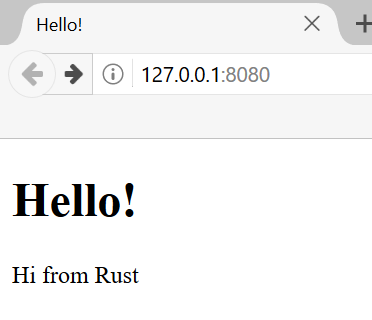

# Final Project: Building a Multithreaded Web Server

นับเป็นการเดินทางที่ยาวนาน แต่ตอนนี้เราได้มาถึงตอนท้ายของหนังสือแล้ว ในบทนี้ เราจะสร้างอีกหนึ่งโปรเจกต์ร่วมกันเพื่อสาธิตแนวคิดบางประการที่เราได้ครอบคลุมในบทสุดท้าย รวมถึงการทบทวนบทเรียนบางบทก่อนหน้านี้ด้วย

สำหรับโปรเจกต์สุดท้ายของเรา เราจะสร้างเว็บเซิร์ฟเวอร์ที่ทักทายว่า “Hello!” และมีหน้าตาเหมือนในรูปที่ 21-1 ในเว็บเบราว์เซอร์

นี่คือแผนของเราในการสร้างเว็บเซิร์ฟเวอร์:

1. เรียนรู้เล็กน้อยเกี่ยวกับ TCP และ HTTP
2. รอรับการเชื่อมต่อ TCP บนซ็อกเก็ต (socket)
3. พาร์ส (parse) คำร้องขอ HTTP (HTTP requests) จำนวนเล็กน้อย
4. สร้างการตอบกลับ HTTP (HTTP response) ที่ถูกต้อง
5. ปรับปรุงปริมาณการประมวลผล (throughput) ของเซิร์ฟเวอร์เราด้วยพูลของเธรด (thread pool)

Figure 21-1: โปรเจกต์สุดท้ายร่วมกันของเรา

ก่อนที่เราจะเริ่ม เราควรกล่าวถึงรายละเอียดสองประการ ประการแรก วิธีการที่เราจะใช้นั้นจะไม่ใช่วิธีที่ดีที่สุดในการสร้างเว็บเซิร์ฟเวอร์ด้วย Rust สมาชิกในชุมชนได้เผยแพร่เครตที่พร้อมสำหรับการใช้งานจริงจำนวนมากไว้ที่ [crates.io](https://crates.io/) ซึ่งมีการอิมพลีเมนต์เว็บเซิร์ฟเวอร์และพูลของเธรดที่สมบูรณ์กว่าสิ่งที่เราจะสร้างขึ้น อย่างไรก็ตาม เจตนาของเราในบทนี้คือเพื่อช่วยให้คุณได้เรียนรู้ ไม่ใช่การเลือกเส้นทางที่ง่าย เนื่องจาก Rust เป็นภาษาโปรแกรมระบบ (systems programming language) เราจึงสามารถเลือกระดับของนามธรรม (level of abstraction) ที่เราต้องการทำงานด้วยได้ และสามารถลงไปในระดับที่ต่ำกว่าสิ่งที่เป็นไปได้หรือทางปฏิบัติในภาษาอื่น

ประการที่สอง เราจะไม่ใช้ async และ await ที่นี่ การสร้างพูลของเธรดเป็นความท้าทายที่ใหญ่พอสมควรในตัวมันเองอยู่แล้ว โดยไม่จำเป็นต้องบวกเพิ่มเรื่องการสร้าง async runtime! อย่างไรก็ตาม เราจะตั้งข้อสังเกตว่า async และ await อาจนำมาประยุกต์ใช้กับปัญหาบางอย่างแบบเดียวกับที่เราจะได้เห็นในบทนี้ได้อย่างไร สรุปแล้ว ดังที่เราเคยตั้งข้อสังเกตไว้ในบทที่ 17 async runtimes จำนวนมากใช้พูลของเธรดเพื่อจัดการงานของพวกมัน

ดังนั้น เราจะเขียน HTTP เซิร์ฟเวอร์พื้นฐานและพูลของเธรดด้วยตนเอง เพื่อให้คุณสามารถเรียนรู้ไอเดียทั่วไปและเทคนิคเบื้องหลังเครตต่างๆ ที่คุณอาจใช้นำไปใช้ในอนาคต
